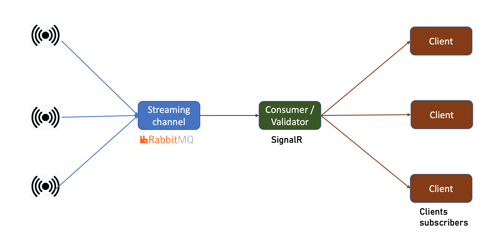
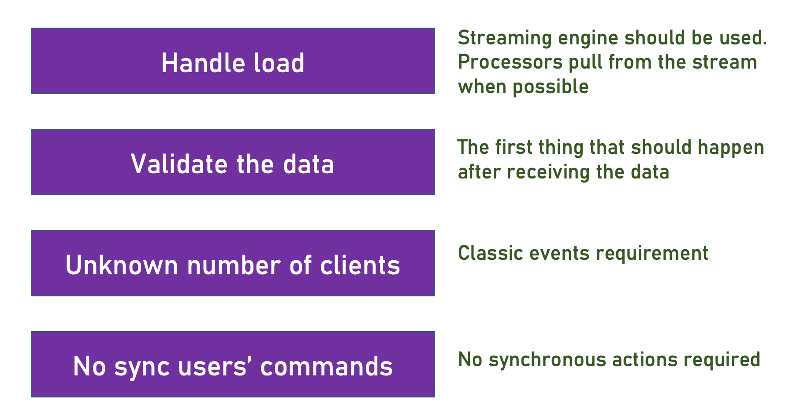

Event Drivien Microservices system with a RabbitMQ channel and SignalR as the consumer service subscribers interface with.

Very minimalist implementation of an event driven microservices application with RabbitMQ channel to handle the streaming of high number of noise data packs sent by an n-number of stations (producers), validated by a SignalR validator consumer servicing a n-number of subscribers.
 
Note: In a normal microsersevice eda implementation there would be additional critical global services added as part of the overall software design architecture, such as loggin, monitoring, security, etc.  

Depending on the volume and frequency of the inter-services communication, service mesh controller and paired sidecar service may also be needed to transparently add capabilities like observability, traffic management,load balancing, failure recovery, metrics,and other non functional must have, specially as additional services are added and the level of complexity increases.  

All these key reqs have been ignored here to keep this microservices "eda" as minimalist as possible since the main idea is to demonstrate the use of a third party event-broker such as RabbitMQ.  Note there are several other options available such as kafka, among others.

Basic Requirements:

The tech stack I used were Microsott .net, and RabbitMQ. 

The IDE was Visual Studio Code for the MAC
